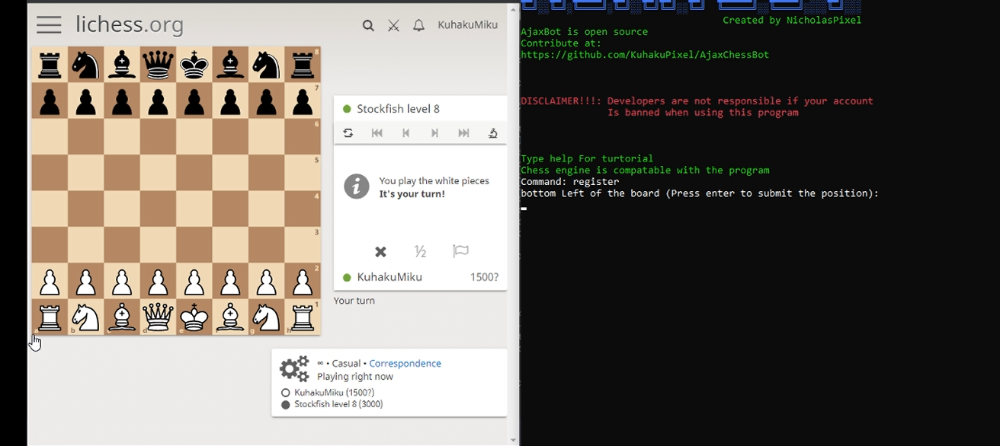
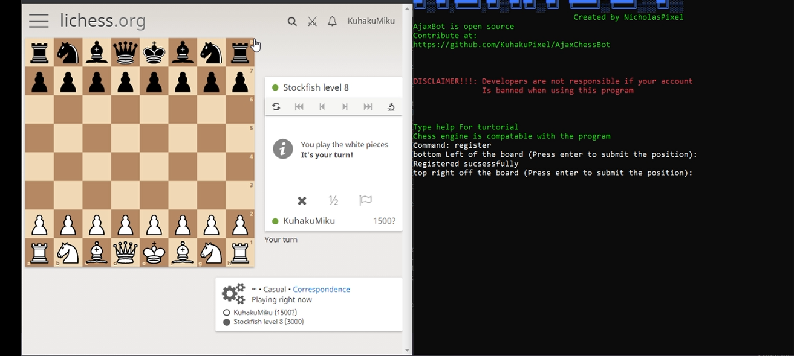
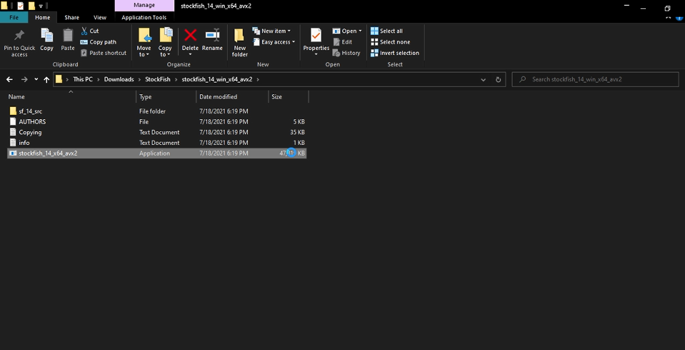
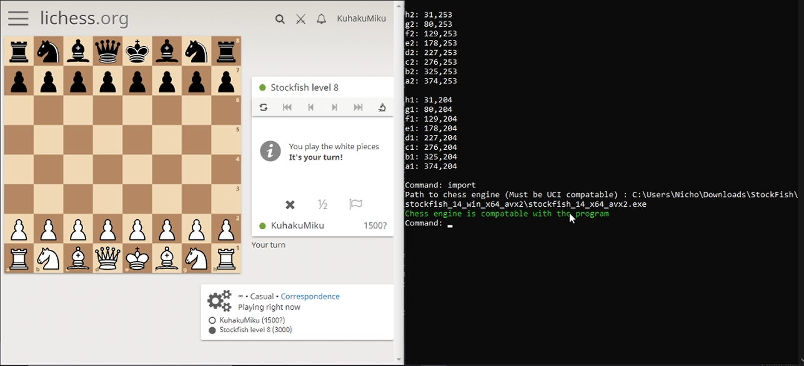
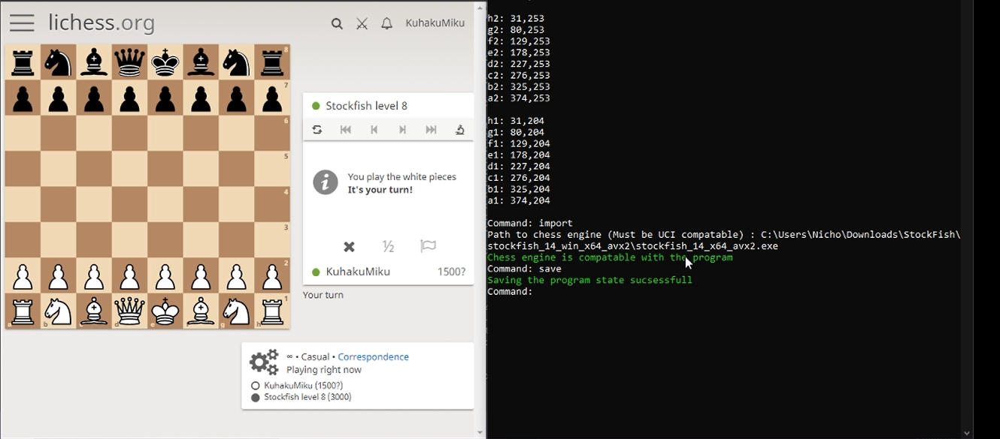

# Turtorial

#### 1. Open the program and enter the "register" command to register the coordinates of the board

#### 2. Hover the mouse to the bottom left corner of the board and press enter to register the coordinate

#### 3. Hover the mouse to the top right corner of the board and press enter to register the coordinate

#### 3. Enter the "import" command to import engine of choice (example : [stockfish](https://stockfishchess.org/download/))
#### 4. Find The path of the engine 

#### 5. Send the path of the engine to the program and press enter ,when sucsess the program will output "Chess engine is compatable with the program" like the image below

#### 6. Enter the "save" command to save all of the configuration so you don't have to do all of the steps above when starting the program again

#### 7.Enter the "play" command and give the game link to let the bot play
        
#### 8.✨Magic ✨

