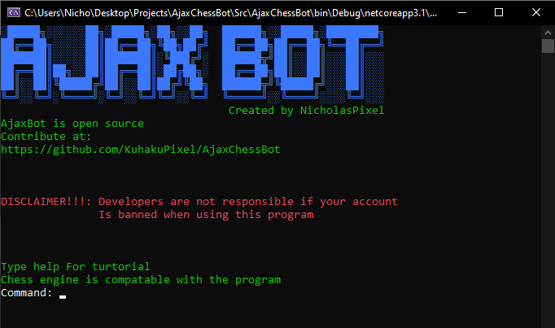

# Ajax Chess Bot
## A chess bot for online chess game

Ajax Chess Bot is free ,open source and light weight Check [Turtorial](https://github.com/KuhakuPixel/AjaxChessBot/tree/master/docs/Turtorial) to learn how to use the program

## Features

- Play an online chess game automatically with an engine of choice

## Installation
Install the program [here](https://github.com/KuhakuPixel/AjaxChessBot/releases/tag/1.00)

Ajax Chess Bot  requires an uci compatable chess engine  to run.

Example of uci compatable engine:
 - [install stockfish](https://stockfishchess.org/download/)

## Development

Want to contribute? Great!

## License

GNU GPLv3

