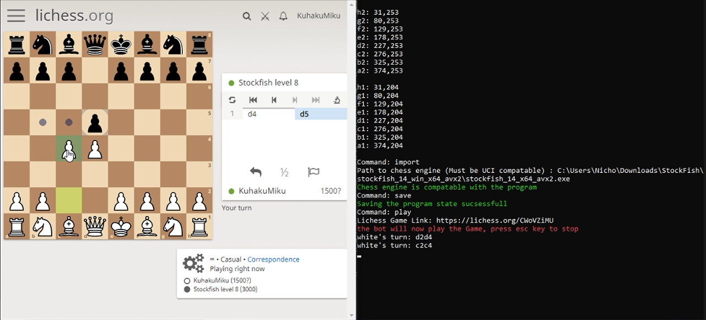

# Ajax Chess Bot

## A chess bot for online chess game

Ajax Chess Bot is free ,open source and light weight Check [Turtorial](https://github.com/KuhakuPixel/AjaxChessBot/tree/master/docs/Turtorial) or [Video Turtorial](https://www.youtube.com/watch?v=0B-lAP5APhU&ab_channel=Hakuku) to learn how to use the program

## Faq

### The exe automatically closes?
This may be caused by an antivirus blocking the `exe`, since 
this programs uses `win api` to click and perform its actions
so it may be seen as dangerous by the antivirus

turn off the antivirus and it may work :D
## Features

- Play an online chess game automatically with an engine of choice

## Installation
Install the program [here](https://github.com/KuhakuPixel/AjaxChessBot/releases/tag/1.00)

Ajax Chess Bot  requires an uci compatable chess engine  to run.

Example of uci compatable engine:
 - [install stockfish](https://stockfishchess.org/download/)

## Development

Want to contribute? Great!

## Supported online chess website
 - lichess.org ✔
 - chess.com ❌

## Future enhancements
- Add Gui for easier setups (ex : open engine list of choice from gui)
- Add support for chess.com
- Use browser automation project such as selenium to make it easier to monitor the state of the game
- Fix slow performance because of 
  - inefficient usage of REGEX
  - Starting and killing the process after sending a move to the engine 
    (which really impacts the performance because setting up the engine again after it has been killed takes time)
## License

[GNU GPLv3](https://github.com/KuhakuPixel/AjaxChessBot/blob/master/LICENSE)

